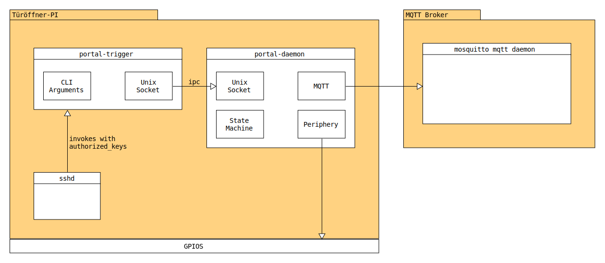

# Portal 300 Source Code

**WARNING: This code is not production-ready yet. Please do not use!**

## Architecture



## Applications

### `portal-trigger`

The user frontend to control the portal. Triggers actions on the current device.

```
portal-trigger [-h] -i <id> -f <name> -n <nick> <action>

Opens or closes the shackspace portal.

The following <action>s are available:
  open       the portal will be unlocked.
  close      the portal will be closed.
  shutdown   the shackspace will be shut down.
  status     the current status of this portal will be printed.

Options:
  -h         Print this help text.
  -i <id>    The member id of the keyholder.
  -f <name>  The full name of the keyholder.
  -n <nick>  The nick name of the keyholder.
```

### `portal-daemon`

The core logic for a portal device. Handles:

- IPC messages from `portal-trigger`
- MQTT control messages
- Sensory and button input via GPIOs

## Building

Requirements:

- GNU `make`
- `gcc`
- `ar`

```sh-session
[user@host portal300]$ make -B
[user@host portal300]$ ls bin
portal-daemon  portal-trigger
[user@host portal300]$
```
