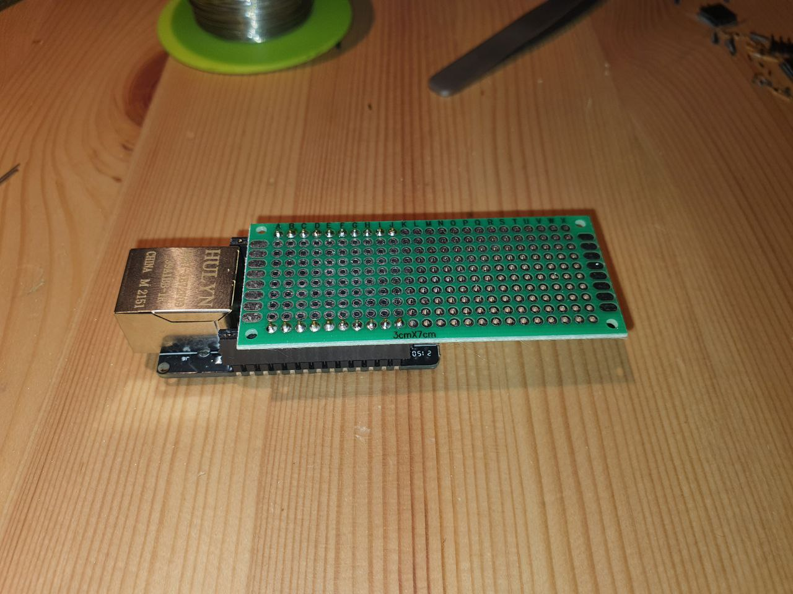
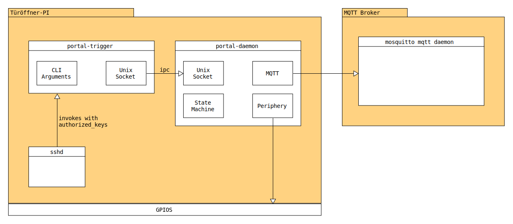

# Portal 300

**WARNING: This code is not production-ready yet. Please do not use!**

## Applications

### `portal-trigger`

The user frontend to control the portal. Triggers actions on the current device.

```
portal-trigger [-h] -i <id> -f <name> -n <nick> <action>

Opens or closes the shackspace portal.

The following <action>s are available:
  open-front the portal will be unlocked via the front door.
  open-back  the portal will be unlocked via the back door.
  close      the portal will be closed.
  shutdown   the shackspace will be shut down.
  status     the current status of this portal will be printed.

Options:
  -h         Print this help text.
  -i <id>    The member id of the keyholder.
  -f <name>  The full name of the keyholder.
  -n <nick>  The nick name of the keyholder.
```

### `portal-daemon`

The core logic for a portal device. Handles:

- IPC messages from `portal-trigger`
- MQTT control messages
- Sensory and button input via GPIOs

## Devices

### _Busch Welcome_ Interface for Portal300

This repository implements an interface to the [Busch Welcome](https://www.busch-jaeger.de/busch-welcome) installed in the Ulmer Straße 300.

This code is part of the project [Portal 300](https://wiki.shackspace.de/infrastruktur/portal300), the new portal infrastructure for shackspace.

#### Hardware

The microcontroller board for this project is the [WT32-ETH01](http://www.wireless-tag.com/portfolio/wt32-eth01/) which has a LAN 8720 PHY installed.

More information on this board can be found [in this repository](https://github.com/ldijkman/WT32-ETH01-LAN-8720-RJ45-).

##### ESP32 interfaces

- The ESP32 will interface network via RMII ethernet
- IO39 is used as an output to press the "Open Door" button and unlock the front door.
- IO15 is used as an input, responding to the door bell.

##### Adapter Board

We created a small adapter board that is sitting on top of the WT32-ETH01:



The wire colors transport the following signals:

| Wire   | Signal                                          |
| ------ | ----------------------------------------------- |
| gray   | GND                                             |
| orange | Power Supply (5V)                               |
| yellow | doorbell was triggered (gray ist reference GND) |
| brown  | emitter for "Open Door" button                  |
| purple | collector for "Open Door" button                |

## Architecture



### Decisions

- Using C as it's a stable programming environment
  - We depend on software that is already there for years and won't change quickly
- Using daemon/trigger architecture
  - to decouple the security relevant logic from the user-facing application
  - to manage double-use by multiple people
- Using MQTT for communications
  - Established standard
  - Available software (mosquitto) and libraries (mqtt-c)
  - TLS support with client certificates

## Fault Vectors

This section contains a list of recognized fault vectors that can bring portal activity down or allows unauthorized users to enter the building.

- Usage mistakes
  - Early SSH disconnect
  - Concurrent use of open/close APIs
- Programming mistakes
  - Out of bounds access
  - Missing error handling
- Attack vectors
  - IP spoofing / MITM
  - Storage manipulation

## Building Applications

General Requirements:

- GNU `make`
- `gcc`
- `ar`
- `libssl-dev`

Additional packages that need to be installed for Raspbian OS besides the default ones:

- `git`
- `libssl-dev`

```sh-session
[user@host portal300]$ make -B
[user@host portal300]$ ls bin
portal-daemon  portal-trigger
[user@host portal300]$
```

## Building Firmware

Install the [`esp-idf`](https://docs.espressif.com/projects/esp-idf/en/latest/esp32/get-started/index.html) by Espressif, then make sure `idf.py` is in your path:

```sh-session
[user@host portal300]$ idf.py  --version
ESP-IDF v4.4
[user@host portal300]$
```

Then, you need to build the firmware for `busch-interface` and `door-control`:

```sh-session
[user@host portal300]$ idf.py -C firmware/busch-interface/ build

<-- snip -->

Project build complete. To flash, run this command:
python ../../../forks/esp-idf/components/esptool_py/esptool/esptool.py -p (PORT) -b 460800 --before default_reset --after hard_reset --chip esp32 write_flash --flash_mode dio --flash_size detect --flash_freq 40m 0x1000 firmware/busch-interface/build/bootloader/bootloader.bin 0x8000 firmware/busch-interface/build/partition_table/partition-table.bin 0x10000 firmware/busch-interface/build/portal300-buzzer.bin
or run 'idf.py -p (PORT) flash'
[user@host portal300]$ idf.py -C firmware/door-control/ build

<-- snip -->

Project build complete. To flash, run this command:
python ../../../forks/esp-idf/components/esptool_py/esptool/esptool.py -p (PORT) -b 460800 --before default_reset --after hard_reset --chip esp32 write_flash --flash_mode dio --flash_size detect --flash_freq 40m 0x1000 firmware/door-control/build/bootloader/bootloader.bin 0x8000 firmware/door-control/build/partition_table/partition-table.bin 0x10000 firmware/door-control/build/door-control.bin
or run 'idf.py -p (PORT) flash'
[user@host portal300]$
```

## Internal Architecture

### Daemon

The daemon initializes itself and falls into a large endless loop which receives all application relevant events via `poll`.
This allows us to handle everything asynchronously without multithreading and react to events in a low time. It also saves energy
for when no communication happens.

### Trigger
